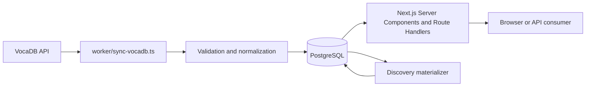
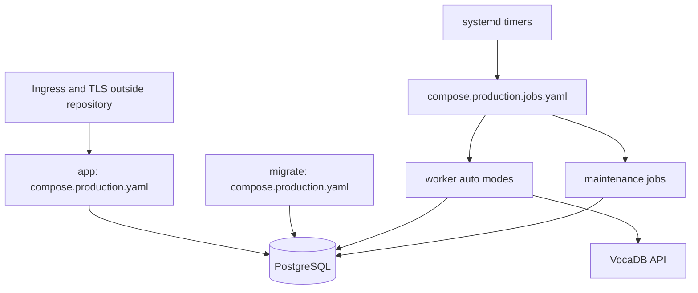

# Architecture Reference

## Local-First Catalog

VocalHub synchronizes catalog data from VocaDB into PostgreSQL. Browser and API consumers are served by Next.js Server Components and Route Handlers that read the local database snapshot. Request paths do not call VocaDB.

VocaDB access is restricted to the worker and `src/lib/vocadb/`; page and API request paths must remain local-data reads. Durable `SyncRun` and `SyncItem` records belong to worker execution. Discovery materialization and discovery snapshot cleanup are maintenance work that reads and writes PostgreSQL.

## Production Topology

Production deployment separates the application and migration Compose artifact from one-shot worker and maintenance jobs. Ingress and TLS are configured outside this repository.

`compose.production.yaml` owns `app` and `migrate`. `compose.production.jobs.yaml` owns worker and maintenance one-shot services. Activating systemd units and timers remains an operator responsibility; the [production deployment runbook](production-deployment-runbook.md) owns the related procedures.

## Identifier and Privacy Boundaries

Public catalog identifiers are local UUIDs. A source `vocadbId` identifies the upstream record and is not the public local identifier.

Favorites and private playlists are private account-library data. Auth.js provides GitHub OAuth with database-backed sessions, and authenticated account operations enforce the viewer boundary. Publicly shared playlists are a separate visibility surface and are subject to moderation status.

Playlist moderation is deployment-only: its command-line operations require operator shell and database access. They are documented in the [production deployment runbook](production-deployment-runbook.md), not exposed as an application API.

## Route Domains

| Domain | Surface | Boundary |
| --- | --- | --- |
| Public catalog | `/api/songs`, `/api/artists`, `/api/tags` and detail/works routes | local public catalog data |
| Authentication | `/api/auth/[...nextauth]` | Auth.js session and GitHub OAuth |
| Account export | `/api/account/export` | authenticated private account data |
| Health | `/api/health` | service health |
| Operations | `/api/ops/status` | token-protected operational state |
| Account mutations | Server Actions in `src/lib/account/actions.ts` | authenticated private writes |

No OpenAPI specification exists. Mutable account workflows are Server Actions, and the current Route Handlers are not a complete REST API.
